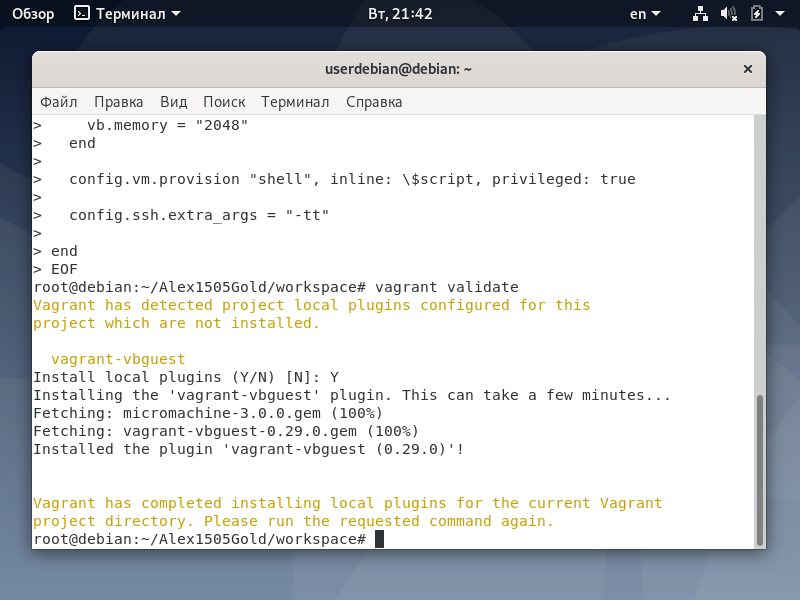

<h1>Отчет по лобораторной 10</h1>
</br>gmail почта - sgolenkov2002@gmail.com </br>
telegram - @Xacker_ducker

<h2>Ход выполнения лабораторной работы:</h2>

Были выплнены следующие команды
```shell
export GITHUB_USERNAME=Alex1505Gold
export PACKAGE_MANAGER=apt-get
cd ${GITHUB_USERNAME}/workspace
${PACKAGE_MANAGER} install vagrant
```
Предложенная команда для скачивания работает не корректно, поэтому vagrant был установлен следующим образом
```shell
sudo apt update
curl -O https://releases.hashicorp.com/vagrant/2.2.6/vagrant_2.2.6_x86_64.deb
sudo apt install ./vagrant_2.2.6_x86_64.deb
```
Также для дальнейшей работы был установлен virtualbox следующим образом
```shell
sudo apt install gcc make linux-headers-$(uname -r) dkms
wget -q https://www.virtualbox.org/download/oracle_vbox_2016.asc -O- | sudo apt-key add -
wget -q https://www.virtualbox.org/download/oracle_vbox.asc -O- | sudo apt-key add -
sudo sh -c 'echo "deb http://download.virtualbox.org/virtualbox/debian $(lsb_release -sc) contrib" >> /etc/apt/sources.list.d/virtualbox.list'
sudo apt update
sudo apt install virtualbox-6.0
```
```shell
vagrant version
vagrant init bento/ubuntu-19.10
less Vagrantfile
vagrant init -f -m bento/ubuntu-19.10
mkdir shared
cat > Vagrantfile <<EOF
\$script = <<-SCRIPT
sudo apt install docker.io -y
sudo docker pull fastide/ubuntu:19.04
sudo docker create -ti --name fastide fastide/ubuntu:19.04 bash
sudo docker cp fastide:/home/developer /home/
sudo useradd developer
sudo usermod -aG sudo developer
echo "developer:developer" | sudo chpasswd
sudo chown -R developer /home/developer
SCRIPT
EOF
cat >> Vagrantfile <<EOF

Vagrant.configure("2") do |config|

  config.vagrant.plugins = ["vagrant-vbguest"]
EOF
cat >> Vagrantfile <<EOF

  config.vm.box = "bento/ubuntu-19.10"
  config.vm.network "public_network"
  config.vm.synced_folder('shared', '/vagrant', type: 'rsync')

  config.vm.provider "virtualbox" do |vb|
    vb.gui = true
    vb.memory = "2048"
  end

  config.vm.provision "shell", inline: \$script, privileged: true

  config.ssh.extra_args = "-tt"

end
EOF
vagrant validate

vagrant status
vagrant up # --provider virtualbox
vagrant port
vagrant status
vagrant ssh

vagrant snapshot list
vagrant snapshot push
vagrant snapshot list
vagrant halt
vagrant snapshot pop
  config.vm.provider :vmware_esxi do |esxi|

    esxi.esxi_hostname = '<exsi_hostname>'
    esxi.esxi_username = 'root'
    esxi.esxi_password = 'prompt:'

    esxi.esxi_hostport = 22

    esxi.guest_name = '${GITHUB_USERNAME}'

    esxi.guest_username = 'vagrant'
    esxi.guest_memsize = '2048'
    esxi.guest_numvcpus = '2'
    esxi.guest_disk_type = 'thin'
  end
vagrant plugin install vagrant-vmware-esxi
vagrant plugin list
vagrant up --provider=vmware_esxi
```
Результаты выполнения команд
</br>
</br>
</br>
</br>
</br>
</br>
</br>
